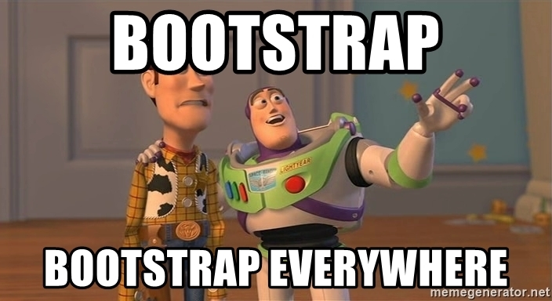

## How it started
When I first learned HTML and CSS, it was in my senior year of high school. That was exactly two years ago. It was a really fun learning experience after doing Python since you can easily see your output as it's a UI/visual language. I enjoyed it a lot, and it was very nitpicky back then. 

Then, I started learning HTML and CSS again for my Software Engineering class. It wasn’t too bad since I was a little rusty, but I knew how the language worked. My professor introduced us to Bootstrap 5, and at first, I thought, “Oh great, another library to use.” I didn’t understand what it was when I was using it for our first assignment until we used it more frequently. And I have to say, it’s actually kinda fun.

## Aha moment using Bootstrap 5
In high school, we just learned how to use raw HTML and CSS, which was a meltdown for some things that I just wanted to look CLEAN. But Bootstrap 5 actually made a difference when I started getting a hang of it. It is so much easier to use Bootstrap classes than to add all the details in the CSS classes. It’s also faster to search for what I want in the library than watching a tutorial or an incompatible StackOverflow code. 

Bootstrap 5 really feels like a cheat sheet for HTML and CSS coding. It's way more efficient to learn how to style with Bootstrap 5 than to type all the CSS classes if you’re looking to be time-efficient. I’ll be honest, though. Bootstrap is a lot, and sometimes I just use raw code because I was originally taught that way. So, I’m not as hyped up about it right now. But I know I will be by the end of this semester when I have practically mastered the basics of it. 
