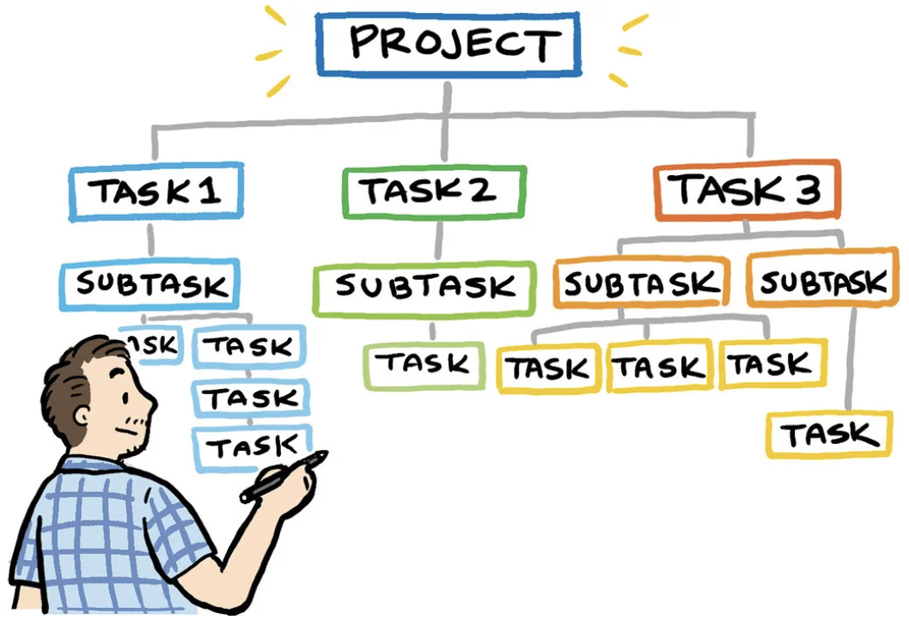

<pre></pre>

 

## Before the experience

I remember first registering for ICS 314 in Fall 2023, and I asked Henri Casanova if ICS 311 and ICS 314 were a bad idea to take simultaneously. He immediately responded, saying that having these classes and my other ICS classes “in the Fall is plenty” and “that would be a lot, honestly.” As someone who felt that Professor Casanova was someone to look up to, based on his astounding ratemyprofessor.com ratings, I felt a lot of pressure from his words and took his advice to spread them out. And I definitely feel like I made the right decision.

I decided to take ICS 314 in Spring 314 with Philip Johnson. Although his ratemyprofessor.com rating was quite varied, I decided to take the chance because reading them didn’t make me feel like I should avoid him at all costs. Plus, it fits my schedule nicely since I prefer morning classes.

## Gaining Admiration

I’ve always aspired to be a “senior software engineer,” whatever that means. So I was a bit nervous about attending his class since my experience in my previous ICS classes left me feeling I had no hope of ever being a good coder. However, Professor Johnson really changed my perspective of the computer science world. Our first day was quite memorable. It wasn’t like any other Syllabus day, but he strongly voiced his opinions about this class to weed out everyone’s doubts that his class would be “just any other computer science class.” Reflecting over this semester, he proved himself right. Within four months, he taught me more than I ever learned in any other computer science class.

## There really is Coding Standards

One concept he taught us was coding standards. One of the most common coding standards implemented was commenting on what everything meant in your code. I hated this because I always saw it as a hassle and just extra work when the people who would grade it were far more experienced in coding than me. It felt useless, but it was always required for the intro classes. This class made me think really hard about it, and I eventually got my “lesson learned” moment when we started working on our group final project. As I finally experienced having to read someone else’s code thoroughly, I couldn’t always understand what they did and why they did it. I eventually understood and was able to help, but when I was reading their code by myself, I couldn’t read it like it was a peer-reviewed essay. When I suggested putting comments when they could, especially if they needed help, it made it so much easier for us to help each other out. The coding standard we used in ICS 314 was ESLint. Although it still felt very obnoxious when it would correct me on every indent I made, it made me habitualize “pretty” coding. ESLint helped make my code stay neat and looking back at my previous classes, I see that my code looked extremely amateur compared to now. It gave me a basic structure on how to always write my code. Ultimately, coding standards helped me in the long run as my projects got bigger, especially when doing collaborative projects.

## Frameworks that make UI design easier?!

One of my favorites was user interface frameworks. As this class confirmed, I am highly interested in front-end development. As a web application class, this made my coding experience feel so rewarding when I could see and change my code with live updates. We used frameworks like Bootstrap and React, which made UI design simpler. This class really improved my UI development skills to make user-friendly interfaces and appealing UI layouts.

## Learning to manage a project

Last but not least, I learned about agile project management. In this case, we used the project boards in GitHub to manage the project tasks for my final project, Kalo Stems. Initially, it seemed like extra work because my team already had plans for what to do. However, after the first milestone, we immediately relied on our project boards to assign and clarify every task and how to get it done. This really helped all of us stay organized and keep everything on track. In general, teamwork is hard when people do not want to choose their own tasks. But our GitHub project board made it really easy for everyone to choose their issues since we were able to read more about it and determine if we really could finish the task on our own. Being able to provide descriptions and simply drag an issue to its current status made communication less difficult.

## A Thank You

Honestly, there are so many things that I learned in this course because of Professor Johnson. He taught us what it means to have skills in software engineering through numerous WODs and ensured we reflected thoroughly on whether we learned or not by not just seeing if we completed the tasks but asking us to do a deep dive on how we could use these skills and knowledge for future use. I’ve gained so much insight into what it takes to be a software engineer, and I have no doubt that I’m several steps closer to getting that “senior software engineer” role.

