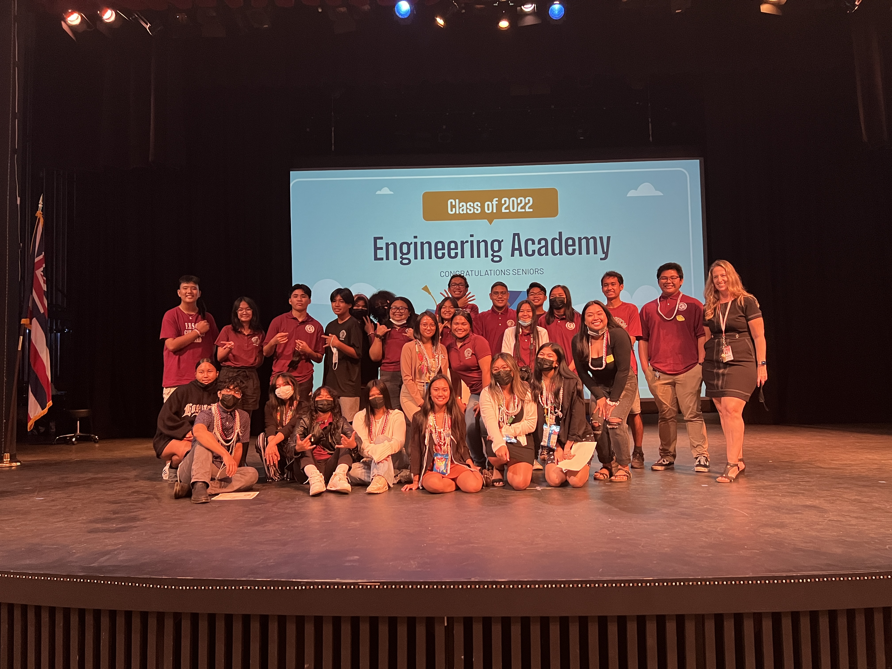
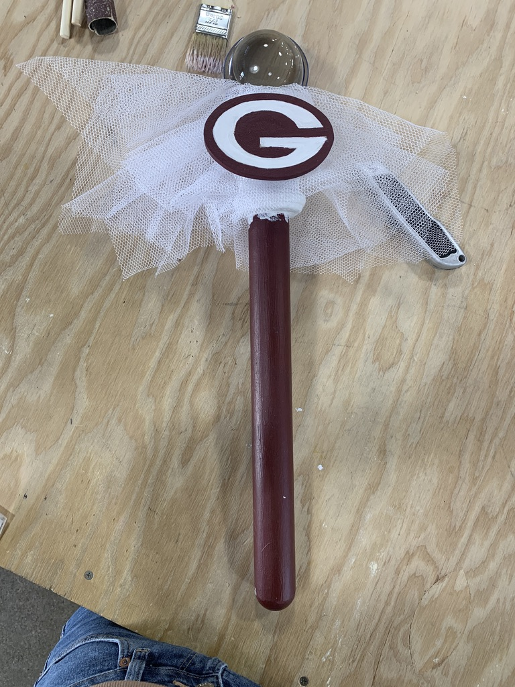

August 2018 - May 2022
This was a student board that focused on bringing a voice to the Engineering Academy’s students and was responsible for Academy events and duties. Some of the tasks I held were creating sheets to analyze and ensure profitable fundraising events, taking charge, and overseeing multiple academy events such as Orientation, Induction, and Graduation. I was one of the few ambassadors that represented the academy at outside events.

In my freshman year, I joined this club when it used to be the Engineering Board. I joined as a member the first year it was officially founded and recognized by Farrington High School. Loving the community around the club, I applied for a leadership role and became their Treasurer in my sophomore and junior years. As a loyal and committed student to the Engineering Board, I decided to become their President for my senior year. This was when we combined our club with the Engineering Ambassadors, who helped give tour guides and promote our academy to nearby schools in the Kalihi district.

The main reason I loved being on this board was the people. My advisor, Jennifer Grant, was one of the best role models I had when progressing in my leadership roles for this club. She always had a positive and confident aura that pushed me to be the best leader I could be at the time. The students I befriended became a huge part of my life, and I became a role model for many of the underclassmen I advised. I guided them, and seeing them grow as a person made me want to continue my work and role to represent our academy for the rest of my high school years. 

[<h2>Engineering Academy Instagram Page</h2>](https://www.instagram.com/fhs.engineering/)
 
[<h2>Official School Website to Engineering Page</h2>](https://www.farringtonhighschool.org/farrington-cte/farrington-engineering-academy/)
 
[<h2>Engineering Academy Website</h2>](https://sites.google.com/k12.hi.us/farrington-high-school/academies-of-farrington/engineering)
<be>

Below are images for one of the last projects we had, which was creating the Spirit Stick for our Homecoming days:

  
  

