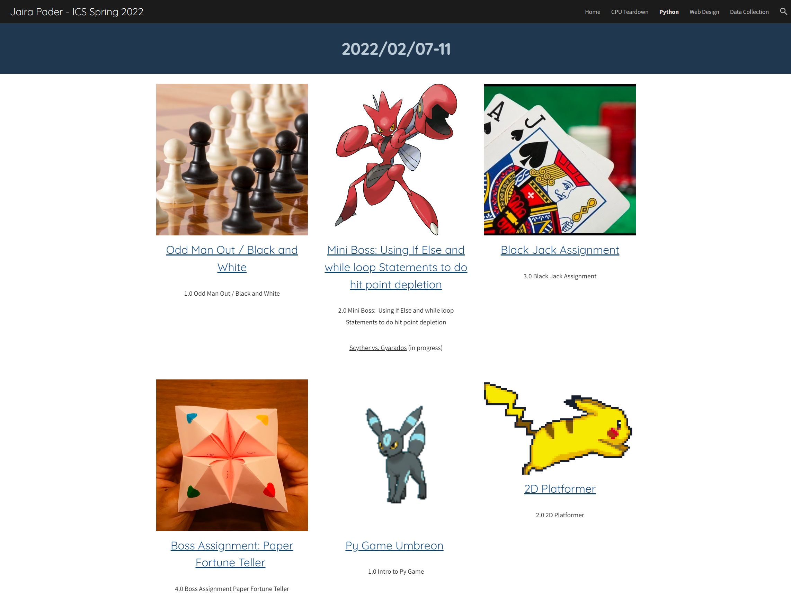

This website portfolio was used to post all our mini-projects. Our coding assignments under "Python" and "Web Design" used a coding website called Replit. We were assigned to create this Google site to encase all our assignments from the start of Python to the end of learning Web Design using HTML, JavaScript, and CSS. We also learned more about CPU teardowns by first understanding the parts and learning how to deconstruct and rebuild the PC without any help. We also learned how to pick PC parts by compatibility and budget. At the end of our class, we learned about IT, like how to create servers and server folders and how to maintain basic security on a Windows PC. We had to modify our accounts using CommandPrompt and our IP addresses. 

This class gave me a big step in understanding the direction of my career. I've always wanted to be part of the tech field, but I never had real experience of how it may feel until this class was introduced in my senior year of high school. I did not regret my choices. This class helped a lot because my teacher explored several fields of computer science within the span of the short semester he could teach us. For example, this class inspired me to build my own PC, and once I had the budget, I finally built my first PC. The game prompts he gave us for the class were so much fun for me and my classmates, and we competed with each other to see who could finish first. 

This was originally a tutorial-like class for the first couple of lessons to learn about syntax and how each language works. After learning our syntax, our teacher gave us numerous prompts to solve by the end of the day with certain conditions. Most, if not all, Replits should have the prompt commented above the code. 

<a href="https://sites.google.com/farringtonhighschool.org/jairapader-icsspring2022/cpu-teardown" target="_blank"> Spring 2022 Computer Science Portfolio</a>

<h1 style="text-align:center;"> Some of my favorite projects are below. </h1>

<a href="https://replit.com/@jairabp/Black-Jack-Assignment#main.py" target="_blank"> Black Jack </a>

<a href="https://replit.com/@jairabp/Boss-Assignment-Make-a-Jan-Ken-Po-User-vs-Bot)" target="_blank"> Jan Ken Po User vs Bot </a>

<a href="https://replit.com/@jairabp/Boss-Assignment-Make-a-Jan-Ken-Po-User-vs-User" target="_blank"> Jan Ken Po User vs User </a>

<a href="https://replit.com/@jairabp/Mini-Boss-Charting-your-Friends#index.html" target="_blank"> Charting Your Friends </a>

