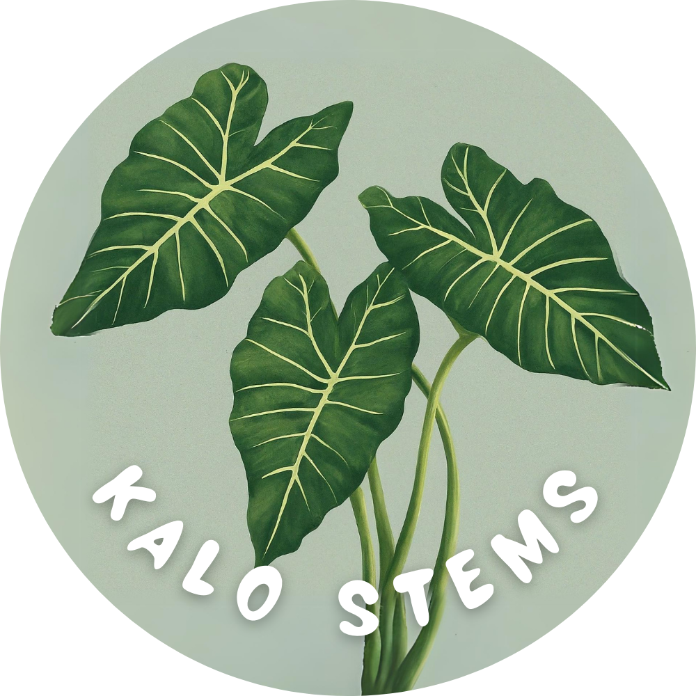
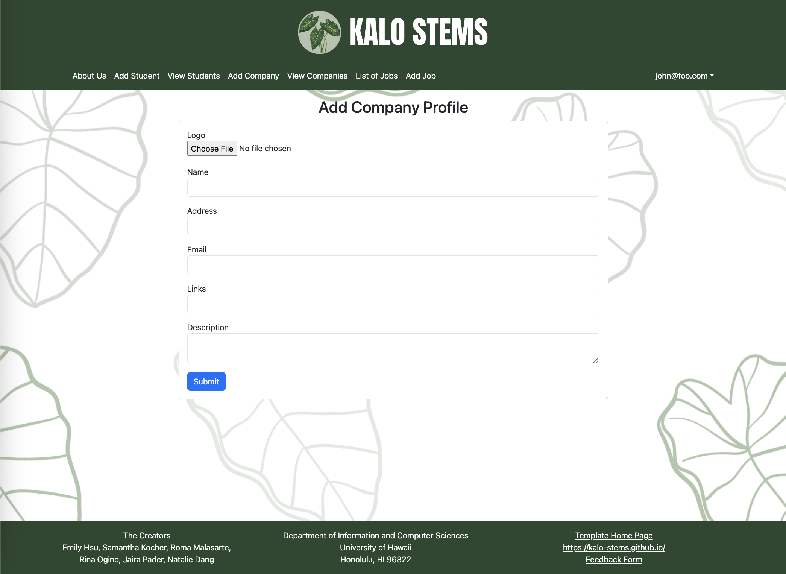
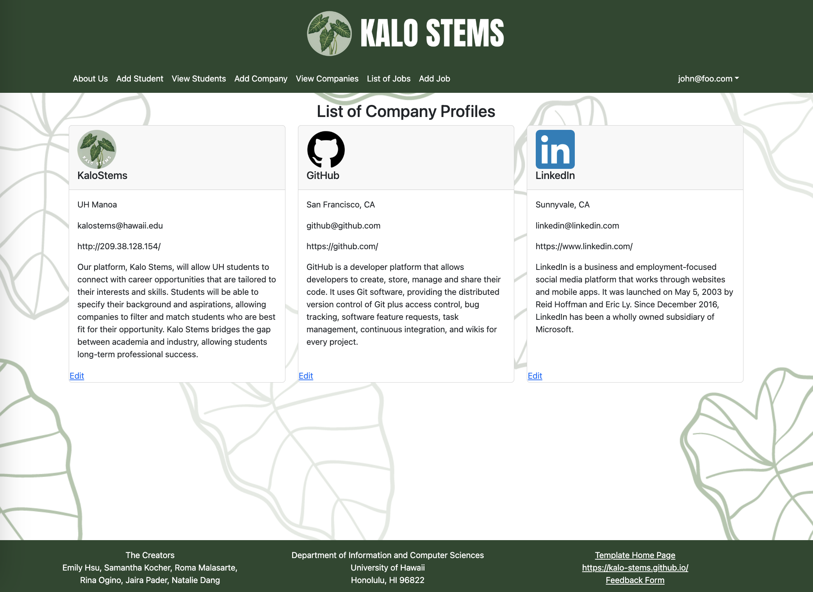
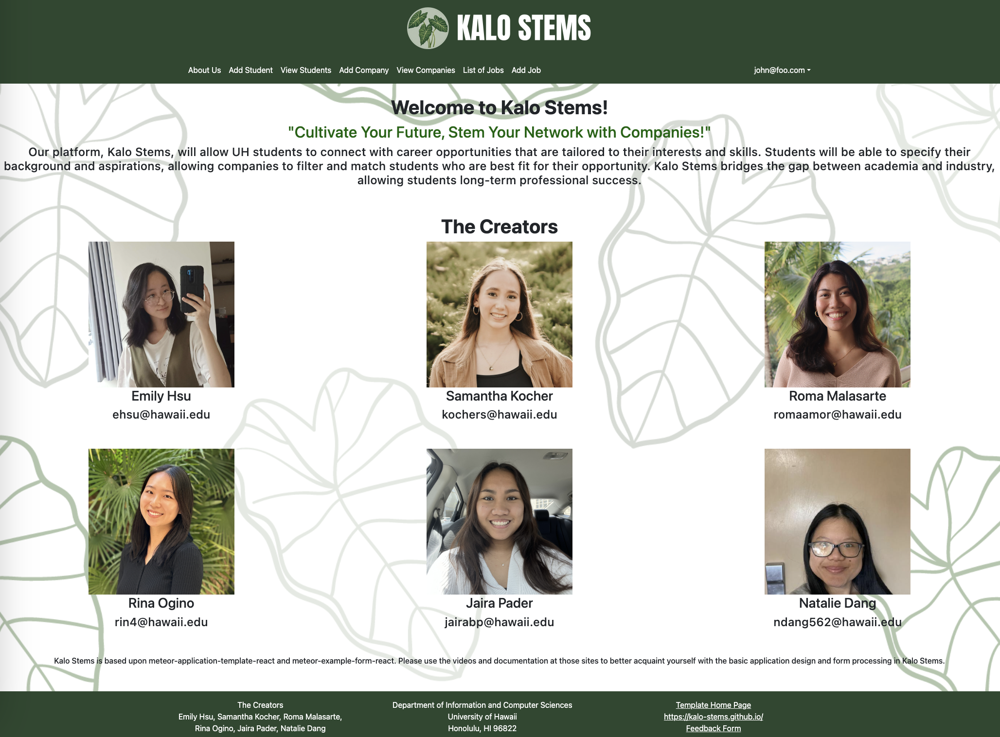

<pre></pre>

## Overview
Kalo Stems allow UH students to connect with career opportunities from several companies. Students will be able to specify their background and aspirations, allowing companies to view students who are the best fit for their opportunity. Kalo Stems bridges the gap between academia and industry, allowing students long-term professional success.

## Contribution
For this project, I developed most of the company attributes. For example, I created pages that allowed companies to make their own profile and show the list of companies that are on our website. I also created the about us page and footer. Other things I did was manage the team in a timely manner to ensure everyone worked on their tasks and review code that needed troubleshooting.

**Company Profile** The Company Profile page contains the ability to add the following company information:

**Company List** The Company List page contains a variety of companies that are looking for potential matches, as well as contact information for students to easily connect with.

**About Us** The About Us page contains our mission for Kalo Stems along with our slogan. It also displays the team members with their pictures along with their names and contact email.

## Links for more information on our application
* [GitHub Organization](https://github.com/kalo-stems)
* [Team Contract](https://docs.google.com/document/d/1pQhVukBdsgP-iYddv36u0Z7tSdybe16vppzxzfB3U6Q/edit?usp=sharing)
* [Slideshow](https://www.canva.com/design/DAGBZoxKtCk/fQQk6ZFbjSCNc1vgeSsEIQ/edit)