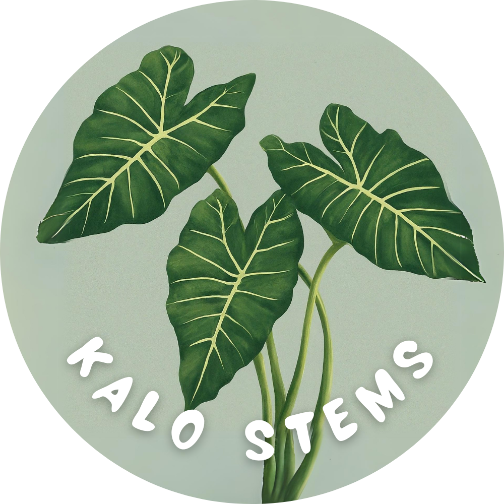

<pre></pre>

## Overview
Kalo Stems allow UH students to connect with career opportunities from several companies. Students will be able to specify their background and aspirations, allowing companies to view students who are the best fit for their opportunity. Kalo Stems bridges the gap between academia and industry, allowing students long-term professional success.

### Landing Page
The landing page is presented to users when they visit the top-level URL to the site. It provides our motto and some previews of our application.

## Links for more information on our application
* [GitHub Organization](https://github.com/kalo-stems)
* [Team Contract](https://docs.google.com/document/d/1pQhVukBdsgP-iYddv36u0Z7tSdybe16vppzxzfB3U6Q/edit?usp=sharing)
* [Slideshow](https://www.canva.com/design/DAGBZoxKtCk/fQQk6ZFbjSCNc1vgeSsEIQ/edit)
* 