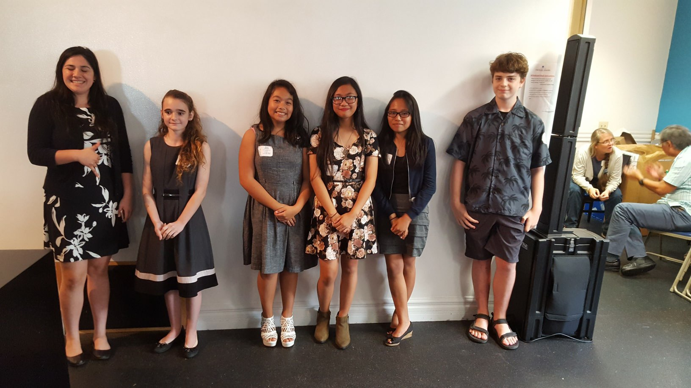
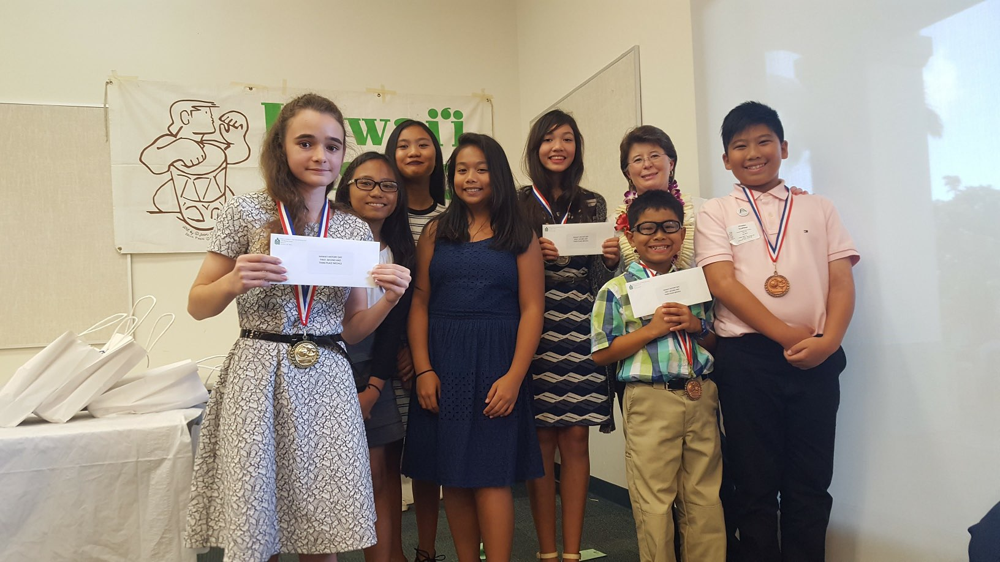

  
  
  <!-- -->

When I was in 7th grade, I created a National History Day project based on the theme "Taking a Stand in History." My two partners and I decided to focus on the Children's March, which was a stand for civil rights in Birmingham, Alabama. Our project proceeded to the Districts Division for Oahu, then the States Division for Hawaii, and to the Nationals Division in Washington D.C.

My school, King David Kalakaua Middle School, wrote a blurb of my team winning as a State Qualifier for the National Division in their newsletter [here.](https://www.kalakauamiddle.org/ourpages/auto/2016/8/8/38704617/2017_05%20KMS%20Newsletter.pdf)

 
The final documentary we presented for the National Division may be watched here: 

 
<iframe width="560" height="315" src="https://www.youtube.com/embed/XD5l2r5Hgcw?si=zGqjLKOngu1dIgHC" title="YouTube video player" frameborder="0" allow="accelerometer; autoplay; clipboard-write; encrypted-media; gyroscope; picture-in-picture; web-share" allowfullscreen></iframe>

## The following is our Process Paper, a summary and explanation of why we chose our topic.</h3>

In 1963, Birmingham, Alabama, the Children’s March had occurred. It was a stand for Civil Rights to obtain equal education and help prevent future generations from suffering what they lived through.

For this year's National History Day project, we wanted a topic about segregation because there has been many stands for Civil Rights and we think that this is one of the most important ones. Another reason why we chose this topic is because of a book that we read in 6th grade where a family went to visit relatives in Birmingham, Alabama. The book was a historical fiction based on events that had happened in the march. We chose this particular event because it was very moving, the children got together and faced a problem that was so cruel to comprehend at their age. It showed us that they knew this problem very well. They also protested in a peaceful way instead of a violent way, which was very smart of them because that would have promoted violence, thus building a bad reputation for themselves. 

We had conducted our research by using reliable websites and a book from our school library. During the next few days we spent countless hours researching everything we could about this topic such as what precisely happened, which people were involved, how the world reacted and if they did actually achieve anything in the end. 

We chose to do a documentary because we felt like doing a documentary would really bring to life what happened at the march and would do it the most justice. Our biggest problem was creating a script for the documentary that showed all of our research and information but we overcame it by deciding to do a timeline type of thing. During the month or so we had to improve our documentary, we did many things. We revised our script and added a better conclusion. We added better pictures and credited them. We added credits and video clips of events that happened. We fixed our voice over and made sure it was at the same volume. 

The Children's March was a stand consisting mostly of black children that stood up for equality and to stop segregation. Though many have a gotten arrested and/or harmed through the process of the protest, they still won in the end because the city officials agreed to desegregate the city. Now, although there's still racism, there's no denying that the Children's March definitely had an effect on how society behaves today and the ongoing battle with racism. All in all, it was a stand that was an important turning point in history. 

